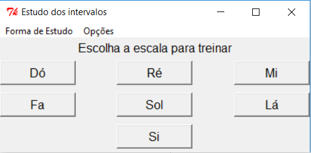
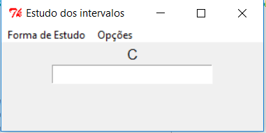

# Musical-Interval-Study (Estudo dos intervalos musicais)
Interface developed to the study of musical intervals in Tkinter. The student can study the intervals by identifying the note (or interval) for the shown interval (or note).

>Interface desenvolvida para o estudo dos intervalos musicais em Tkinter. O aluno pode estudar os intervalos identificando a nota (ou intervalo) para um dado intervalo (ou nota).

## Prerequisites (Pré-requisitos)

- Python 2.7

## User Guide (Guia para o usuário)

Estando o python 2.7 instalado, o programa pode ser inicilizado clicando duas vezes sobre o **estudo_intervalos.py**. A seguinte janela será aberta:

É possível escolher a forma que será estudado os intervalos: identificando o intervalo pela nota (**Nota-Intervalo**, padrão), ou identificando a nota pelo intervalo (**Intervalo-Nota**), selecionando pela opção **Forma de estudo**.

Escolhe-se qual escala quer-se estudar clicando sobre ela. A tela seguinte procederá os estudos de tal intervalo como mostrado abaixo:

Você deve escrever o intervalo (ou nota) e clicar *<ENTER>* para conferir a resposta. Para maiores informações de como proceder aos estudos, vá em **Opções**->**Tutorial**. Caso queira encerrar um estudo vá em **Opções**->**Voltar Menu**.
